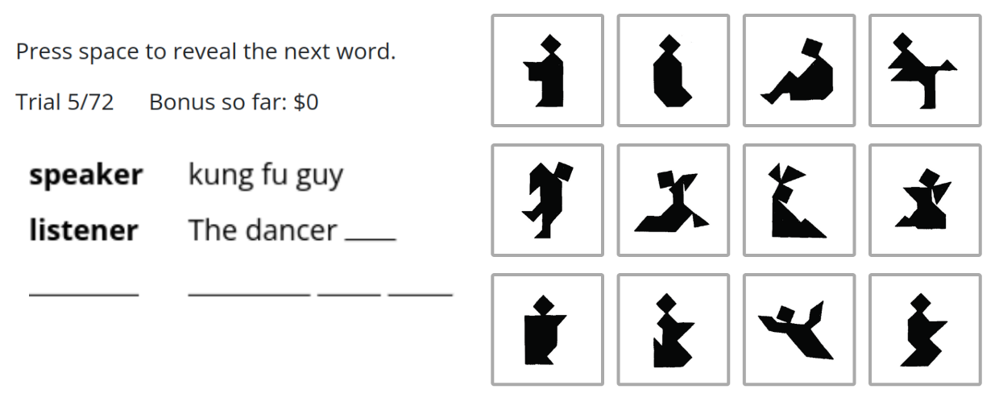

```{r global_options, include=FALSE}
knitr::opts_chunk$set(
  fig.width = 3, fig.height = 3, fig.crop = F,
  fig.pos = "tb", fig.path = "figs/",
  echo = F, warning = F, cache = F,
  message = F, sanitize = T
)

library(png)
library(grid)
library(ggplot2)
library(xtable)
library(tidyverse)
library(here)
library(brms)
library(rstan)
library(rstanarm)
library(ggthemes)
library(jsonlite)
library(ggthemes)
library(scales)
library(viridis)
library(ggridges)
library(cowplot)
library(tidybayes)

rstan_options(auto_write = TRUE)
options(mc.cores = parallel::detectCores())
theme_set(theme_bw())

data_loc <- "data"
mod_loc <- "analysis-code/models"
images <- "experiments/expt1/assets/images"
prediction_loc <- "model-code/model_predictions"
mod_results <- "analysis-code/models/summary"
mod_form <- "analysis-code/models/formulae"
mod_me <- "analysis-code/models/mixed_fx"


expt_1_data <- read_csv(here(data_loc, "expt1_full_data.csv")) |>
  select(-proliferate.condition) |>
  filter(!is.na(response)) |>
  filter(!is.na(correct_tangram)) |>
  select(
    workerid, button_rt, condition, correct, correct_tangram,
    gameId, selected, text, trial_index
  ) |>
  mutate(workerid = as.factor(workerid)) |>
  mutate(rt_sec = button_rt / 1000) |>
  separate(condition, c("group_size", NA, "round")) |>
  mutate(
    group_size = str_c(group_size, "_player"),
    round = str_c("round_", round),
    correct = as.numeric(correct)
  ) |>
  group_by(workerid) |>
  mutate(trial_order = row_number()) |>
  ungroup() |>
  mutate(source = "naive", expt = "Expt 2", thickness = "medium")

expt_2_data <- read_csv(here(data_loc, "expt2_full_data.csv")) |>
  select(-proliferate.condition) |>
  filter(!is.na(response)) |>
  filter(!is.na(correct_tangram)) |>
  select(
    workerid, button_rt, condition, correct, correct_tangram,
    gameId, selected, text, trial_index
  ) |>
  mutate(workerid = as.factor(workerid)) |>
  mutate(rt_sec = button_rt / 1000) |>
  separate(condition, c("group_size", "thickness", "round")) |>
  mutate(
    condition = str_c(group_size, "_", thickness),
    group_size = str_c(group_size, "_player"),
    round = str_c("round_", round),
    correct = as.numeric(correct)
  ) |>
  group_by(workerid) |>
  mutate(trial_order = row_number()) |>
  ungroup() |>
  mutate(source = "naive", expt = "Expt 2")

expt_3_data <- read_csv(here(data_loc, "tgmatchercalibration-trials.csv")) |>
  select(-proliferate.condition) |>
  filter(!is.na(response)) |>
  filter(!is.na(correct_tangram)) |>
  select(
    workerid, button_rt, correct, correct_tangram,
    gameId, selected, text, trial_index
  ) |>
  mutate(workerid = as.factor(workerid)) |>
  mutate(
    rt_sec = button_rt / 1000,
    correct = as.numeric(correct)
  ) |>
  group_by(workerid) |>
  mutate(trial_order = row_number()) |>
  ungroup() |>
  mutate(source = "naive")

expt_4_data <- read_csv(here(data_loc, "tgmatcheryoked-trials.csv")) |>
  select(-proliferate.condition) |>
  filter(!is.na(correct_tangram)) |>
  select(
    workerid, button_rt, correct, correct_tangram, condition,
    gameId, selected, text, trial_index, type, rt, orig_trialNum, orig_repNum
  ) |>
  mutate(workerid = as.factor(workerid)) |>
  mutate(
    matcher_trialNum = (trial_index - 3) %/% 3,
    matcher_repNum = matcher_trialNum %/% 12
  ) |>
  mutate(workerid = ifelse(workerid == "3157" & condition == "yoked", "3157a", workerid)) |> # somehow two participants were assigned to 3157 -- but each set looks complete?
  filter(workerid != "141") |>
  filter(workerid != "35") |> # exclude two participants who didn't finish
  mutate(source = "naive", round = str_c("round_", orig_repNum + 1))


mlp_mod <- read_csv(here(prediction_loc, "mlp_best.csv")) |>
  pivot_longer(p_A:p_L) |>
  mutate(name = str_sub(name, -1)) |>
  filter(tangram == name) |>
  mutate(
    round = str_c("round_", repNum + 1),
    correct = value,
    source = "model"
  ) |>
  select(correct_tangram = tangram, gameId, round, correct, source)


# Original study accuracies
url <- "https://raw.githubusercontent.com/vboyce/multiparty-tangrams/main/"


one_round_results <- read_rds(str_c(url, "data/study1/round_results.rds")) %>% mutate(rotate = "rotate")
two_a_round_results <- read_rds(str_c(url, "data/study2a/round_results.rds")) %>% mutate(rotate = "no_rotate")
two_b_round_results <- read_rds(str_c(url, "data/study2b/round_results.rds")) %>% mutate(rotate = "full_feedback")
two_c_round_results <- read_rds(str_c(url, "data/study2c/round_results.rds")) |> mutate(rotate = "emoji")
three_round_results <- read_rds(str_c(url, "data/study3/round_results.rds")) |> rename(`_id` = "X_id", condition = name)

one_chat <- read_csv(str_c(url, "data/study1/filtered_chat.csv")) |> mutate(rotate = str_c(as.character(numPlayers), "_rotate"))
two_a_chat <- read_csv(str_c(url, "data/study2a/filtered_chat.csv")) |> mutate(rotate = "no_rotate")
two_b_chat <- read_csv(str_c(url, "data/study2b/filtered_chat.csv")) |>
  mutate(rotate = "full_feedback") |>
  select(-`row num`)
two_c_chat <- read_csv(str_c(url, "data/study2c/filtered_chat.csv")) |>
  mutate(rotate = "emoji") |>
  select(-type)
three_chat <- read_csv(str_c(url, "data/study3/filtered_chat.csv")) |>
  inner_join(read_rds(str_c(url, "data/study3/round_results.rds")) |> select(gameId, trialNum, condition = name) |> unique()) |>
  select(-rowid, -type)

original_results_raw <- one_round_results |>
  rbind(two_a_round_results) |>
  rbind(two_b_round_results) |>
  rbind(two_c_round_results) |>
  mutate(activePlayerCount = NA) |>
  rename(condition = rotate) |>
  rbind(three_round_results) |>
  mutate(
    round = str_c("round_", repNum + 1),
    correct_tangram = tangram,
    correct = ifelse(correct, 1, 0),
    source = "original"
  )

original_results <- original_results_raw |>
  group_by(gameId, correct_tangram, round, source) |>
  summarize(correct = mean(correct)) |>
  select(gameId, correct_tangram, round, correct, source)


original_length <- one_chat |>
  rbind(two_a_chat) |>
  rbind(two_b_chat) |>
  rbind(two_c_chat) |>
  mutate(activePlayerCount = NA) |>
  rename(condition = rotate) |>
  rbind(three_chat) |>
  filter(!is.chitchat) |>
  filter(role == "speaker") |>
  mutate(correct_tangram = str_sub(target, -5, -5)) |>
  group_by(repNum, gameId, correct_tangram, condition, numPlayers) |>
  mutate(utt_length_words = str_count(spellchecked, "\\W+") + 1) %>%
  summarize(
    text = paste0(text, collapse = ", "),
    total_num_words = sum(utt_length_words, na.rm = T) %>% as.numeric(),
    log_words = log(total_num_words)
  ) |>
  mutate(round = str_c("round_", repNum + 1)) |>
  select(gameId, correct_tangram, round, total_num_words, log_words)
```

```{r, eval=F}
do_preds_tangram_2 <- function(model) {
  mod <- here(mod_loc, model) |> read_rds()
  preds <- expand_grid(
    trial_order = 1:60, group_size = c("6_player", "2_player"),
    thickness = c("thick", "thin"),
    round = c("round_1", "round_6"),
    correct_tangram = c("A", "B", "C", "D", "E", "F", "G", "H", "I", "J", "K", "L")
  ) |>
    # add_linpred_draws(mod, value = "predicted", re_formula = NA) |>
    add_linpred_draws(mod, value = "predicted", re_formula = ~ (group_size * thickness * round | correct_tangram)) |>
    group_by(group_size, thickness, round, correct_tangram) |>
    # group_by(group_size, round, correct_tangram) |>
    summarize(
      mean = mean(predicted),
      low = quantile(predicted, .025),
      high = quantile(predicted, .975)
    )
  return(preds)
}

# pred_acc_2 <- do_preds_tangram_2("acc_2.rds") |> write_rds(here(mod_loc, "predicted", "acc_2.rds"))

pred_acc_2 <- do_preds_tangram_2("acc_2.rds") |> write_rds(here(mod_loc, "predicted", "acc_2_tangram.rds"))

do_preds_tangram_1 <- function(model) {
  mod <- here(mod_loc, model) |> read_rds()
  preds <- expand_grid(
    trial_order = 1:60, group_size = c("6_player", "2_player"),
    # thickness = c("thick", "thin"),
    round = c("round_1", "round_6"),
    correct_tangram = c("A", "B", "C", "D", "E", "F", "G", "H", "I", "J", "K", "L")
  ) |>
    add_linpred_draws(mod, value = "predicted", re_formula = ~ (group_size * round | correct_tangram)) |>
    # add_linpred_draws(mod, value = "predicted", re_formula = NA) |>
    # group_by(group_size, thickness, round, correct_tangram) |>
    group_by(group_size, round, correct_tangram) |>
    summarize(
      mean = mean(predicted),
      low = quantile(predicted, .025),
      high = quantile(predicted, .975)
    )
  return(preds)
}

# pred_acc_1 <- do_preds_tangram_1("acc_1.rds") |> write_rds(here(mod_loc, "predicted", "acc_1.rds"))

pred_acc_1 <- do_preds_tangram_1("acc_1.rds") |> write_rds(here(mod_loc, "predicted", "acc_1_tangram.rds"))

do_preds_tangram_mlp <- function(model) {
  mod <- here(mod_loc, model) |> read_rds()
  preds <- expand_grid(
    trial_order = 1:60, group_size = c("6_player", "2_player"),
    thickness = c("thick", "thin", "medium"),
    round = c("round_1", "round_6"),
    correct_tangram = c("A", "B", "C", "D", "E", "F", "G", "H", "I", "J", "K", "L")
  ) |>
    # add_linpred_draws(mod, value = "predicted", re_formula = NA) |>
    add_linpred_draws(mod, value = "predicted", re_formula = ~ (group_size * thickness * round | correct_tangram)) |>
    group_by(group_size, thickness, round, correct_tangram) |>
    # group_by(group_size, round, correct_tangram) |>
    summarize(
      mean = mean(predicted),
      low = quantile(predicted, .025),
      high = quantile(predicted, .975)
    )
  return(preds)
}

do_preds_mlp <- function(model) {
  mod <- here(mod_loc, model) |> read_rds()
  preds <- expand_grid(
    trial_order = 1:60, group_size = c("6_player", "2_player"),
    thickness = c("thick", "thin", "medium"),
    round = c("round_1", "round_6"),
    correct_tangram = c("A", "B", "C", "D", "E", "F", "G", "H", "I", "J", "K", "L")
  ) |>
    add_linpred_draws(mod, value = "predicted", re_formula = NA) |>
    # add_linpred_draws(mod, value = "predicted", re_formula = ~ (group_size *thickness * round | correct_tangram)) |>
    group_by(group_size, thickness, round, correct_tangram) |>
    # group_by(group_size, round, correct_tangram) |>
    summarize(
      mean = mean(predicted),
      low = quantile(predicted, .025),
      high = quantile(predicted, .975)
    )
  return(preds)
}

do_preds_tangram_mlp("acc_mlp_1_2_beta.rds") |> write_rds(here(mod_loc, "predicted", "acc_mlp_beta_tangram.rds"))
do_preds_mlp("acc_mlp_1_2_beta.rds") |> write_rds(here(mod_loc, "predicted", "acc_mlp_beta.rds"))


do_preds_tangram_yoked <- function(model) {
  mod <- here(mod_loc, model) |> read_rds()
  preds <- expand_grid(
    matcher_trialNum = 1:72,
    orig_repNum = 0:5,
    condition = c("yoked", "shuffled"),
    correct_tangram = c("A", "B", "C", "D", "E", "F", "G", "H", "I", "J", "K", "L")
  ) |>
    mutate(consistent = (matcher_trialNum - 1) %/% 12 == orig_repNum) |>
    filter(consistent | condition == "shuffled") |>
    add_linpred_draws(mod, value = "predicted", re_formula = NA) |>
    # group_by(group_size, thickness, round, correct_tangram) |>
    group_by(orig_repNum, condition) |>
    summarize(
      mean = mean(predicted),
      low = quantile(predicted, .025),
      high = quantile(predicted, .975)
    )
  return(preds)
}
do_preds_tangram_yoked("acc_4.rds") |> write_rds(here(mod_loc, "predicted", "acc_4.rds"))

do_preds_tangram_yoked_mlp <- function(model) {
  mod <- here(mod_loc, model) |> read_rds()
  preds <- expand_grid(
    matcher_trialNum = 1:72,
    orig_repNum = 0:5,
    # condition=c("yoked", "shuffled"),
    correct_tangram = c("A", "B", "C", "D", "E", "F", "G", "H", "I", "J", "K", "L")
  ) |>
    add_linpred_draws(mod, value = "predicted", re_formula = NA) |>
    # group_by(group_size, thickness, round, correct_tangram) |>
    # group_by(orig_repNum, condition, correct_tangram) |>
    group_by(orig_repNum) |>
    summarize(
      mean = mean(predicted),
      low = quantile(predicted, .025),
      high = quantile(predicted, .975)
    )
  return(preds)
}
do_preds_tangram_yoked_mlp("acc_yoked_mlp_beta.rds") |> write_rds(here(mod_loc, "predicted", "acc_yoked_mlp_beta.rds"))
```

```{r, eval=F}
library(tidybayes)

save_summary <- function(model) {
  intervals <- gather_draws(model, `b_.*`, regex = T) %>% mean_qi()

  stats <- gather_draws(model, `b_.*`, regex = T) %>%
    mutate(above_0 = ifelse(.value > 0, 1, 0)) %>%
    group_by(.variable) %>%
    summarize(pct_above_0 = mean(above_0)) %>%
    left_join(intervals, by = ".variable") %>%
    mutate(
      lower = .lower,
      upper = .upper,
      Term = str_sub(.variable, 3, -1),
      Estimate = .value
    ) %>%
    select(Term, Estimate, lower, upper)

  stats
}

save_me <- function(model) {
  intervals <- gather_draws(model, `sd_.*`, regex = T) %>%
    mean_qi() |>
    separate(.variable, into = c("group", "Term"), sep = "__") |>
    mutate(
      lower = .lower,
      upper = .upper,
      group = str_sub(group, 4, -1),
      Estimate = .value
    ) %>%
    select(group, Term, Estimate, lower, upper)

  intervals
}

do_model <- function(path) {
  model <- read_rds(here(mod_loc, path))
  save_summary(model) |> write_rds(here(mod_loc, "summary", path))
  model$formula |> write_rds(here(mod_loc, "formulae", path))
  print(summary(model))
}

do_me <- function(path) {
  model <- read_rds(here(mod_loc, path))
  message(path)
  save_me(model) |> write_rds(here(mod_loc, "mixed_fx", path))
}

mods_me <- c(
  "acc_1.rds", "acc_2.rds", "acc_4.rds", "acc_mlp_1_2_beta.rds", "acc_yoked_mlp_beta.rds", "yoked_shuffled_original.rds"
) |> walk(~ do_me(.))


mods <- list.files(path = here(mod_loc), pattern = ".*rds") |> walk(~ do_model(.))
```

```{r}
stats <- function(model, row, decimal = 2) {
  model <- model |>
    mutate(
      Estimate = round(Estimate, digits = decimal),
      Lower = round(lower, digits = decimal),
      Upper = round(upper, digits = decimal),
      `Credible Interval` = str_c("[", Lower, ", ", Upper, "]")
    ) |>
    select(Term, Estimate, `Credible Interval`)
  str_c(model[row, 1], ": ", model[row, 2], " ", model[row, 3])
}

stats_text <- function(model, row, decimal = 2) {
  model <- model |>
    mutate(
      Estimate = round(Estimate, digits = decimal),
      Lower = round(lower, digits = decimal),
      Upper = round(upper, digits = decimal),
      `Credible Interval` = str_c("[", Lower, ", ", Upper, "]")
    ) |>
    select(Term, Estimate, `Credible Interval`)
  str_c(model[row, 2], "  ", model[row, 3])
}

form <- function(model_form) {
  dep <- as.character(model_form$formula[2])
  ind <- as.character(model_form$formula[3])

  str_c(dep, " ~ ", ind) |>
    str_replace_all(" ", "") |>
    str_replace_all("\\*", " $\\\\times$ ") |>
    str_replace_all("\\+", "&nbsp;+ ") |>
    str_replace_all("~", "$\\\\sim$ ")
}
```


# Introduction

TODO need an actually good hook/intro
We can often understand what people are saying even when we are not the intended audience. From snippets of overheard conversation, we can construct what is going on well enough to understand it. 

We can understand more than we produce; for instance, even if I would call the object a "water fountain" I can understand what another person means when they say "bubbler". 

While some different terms are conventionally set and shared among large groups of people as language, or regional dialect, or field specific jargon, temporary conventions can be formed with smaller groups of people as a matter of conversational necessity to have a term to refer to a thing with. 

This formation of temporary linguistic conventions between individuals is often studied in iterated reference games. In these games, a describer tells their partner or partners how to sort or match a series of abstract images [@clark1986; @hawkins2020b]. Over repeated rounds, the same set of images are referred to repeatedly and pairs usually develop agreed upon nicknames for the target images. These nicknames are often partner-specific, in that different pairs develop different nicknames for the same targets. Describers seem to expect that naive partners will need more elaborated descriptions. The same describer may use different terms for the target image if their partner changes, for instance going back to more elaborated terms with a new partner, even if that partner was present in the room [@yoon2018; @wilkes-gibbs1992].  [OTHER THINGS WE COULD CITE]

How strongly partner-specific are the conventions created in iterated reference games? Are they merely created for in the context of the partnership, or are they also only or mostly interpretable to those who were part of the in-group?  The partner-specifity of conversational pacts is often studied by looking at how the pacts are created, and how utterances change over the course of games [@hawkins2020b; @boyce2024]. Another angle on convention formation is to look at the degree of arbitrariness by seeing how understandable the conventions are to others who were not part of the interaction that originated the convention. A more arbitrary convention should be harder to understand. 

Asking naive matchers to interpret utterances produced during iterated reference games thus can provide an additional perspective by determining how the features of the utterances and the conditions they were produced under affect how opaque they are, and provide empirical tests of whether descriptions become more opaque over the course of the reference game. 

Some prior work has investigated how well naive matchers can understand the descriptions produced in the course of an iterated reference game, with a focus on how the presence or absence of the shared history affects understanding. 

@murfitt2001 had 8 participants describe tangram shapes in an iterated matching game with or without a partner, and then played the recorded descriptions to new listeners either in round order or in reverse round order. Naive listeners were more accurate when the heard descriptions in the order they were produced rather than the reverse order. @murfitt2001 also looked at various features of the descriptions such as utterance length and definiteness, but none of these features significantly predicted accuracy. TODO look up actual accuracy rates? 

@schober1989 had pairs of participants repeatedly arrange arrays of 12 tangram figures from an overall pool of 16 figures. The in-game matchers had mean accuracies above 90% and rising to close to 100% by the 6th repetition. Naive listeners who heard the entire game in order, either live, as it was played, or on recording, had accuracies that started around 75% and rose to 90%. Matchers who listened to recordings starting in the 3rd round of the round of the game did worse, with initial accuracies around 55% that rose slowly to 70%. TODO double check if they report numbers of if we're just eyeballing the plots

In an iterated reference game using drawing (rather than text) as the communication modality, @hawkins2023a compared the accuracy of matchers who were part of the reference game to later naive matchers in yoked and shuffled conditions. The yoked matchers saw all the trials from one game in the same order as they occurred; the shuffled matchers saw trials sampled from 10 games but ordered based on when in the games they occurred. In-game matchers were more accurate overall (88% on 4-way choice) than yoked matchers (75%) who were in turn more accurate than shuffled matchers (TODO I don't think this number of reported...). Over the course of trials, both in-game and yoked matchers showed steeper improvement in accuracy than shuffled matchers. 
            
While "overhearers" have worse accuracy than in-game matchers, their performance is still far above chance, suggesting that at least some of the content of referential pacts is accessible. In fact, even when pairs of participants try to obfuscate their meaning to match images with each other but not an overhearer, an overhearing participant can still do quite well. In @clark1987a, the target matcher had an average accuracy of 80% rising to 95% over repetitions (on a set of 8 targets) while overhears had an average accuracy of 45%, despite the goal being to prevent the overhearers comprehension. TODO maybe don't include 

Across these studies, recieving more context from one interaction, and in particular, having that context be in order, is beneficial to matchers. Except for the shuffled condition of @hawkins2023a, these studies do not address how well matchers do at isolated descriptions from different games and points in the game. 

The outside perspective on iterated reference games has also been used to disentangle comprehension and production abilities, by providing descriptions from the first and last rounds of a parent-child iterated reference game to adults and children serving as naive matchers [@leung2024]. They found no significant difference in how comprehensible early and late desciptions were to naive matchers. TODO look up actual accuracy rates relative to live!


## ALvin gets to write computational intro here
Do we also want to motivate this from a computational angle? (i.e. trying to add pragmatics to models) TODO not me


TODO some paragraph to transition back to the important questions 

In the current work, we ask how does the process of convention formation determine how easy a referential expression is for an outsider to understand. Using reference expressions created in different games from @boyce2024, we use both human experiments and models to assess when and why expressions are opaque or understandable to outside observers. 

# Task Setup

## Materials

We draw on the corpus of reference game transcripts and results from @boyce2024. There were all 6 round iterated reference games using the same 12 target images, but varied in how large the groups were (2-6 participants per group) and how "thick" the communication channel between group members was. For our human experiments, we sample different subsets of this corpus in different experiments. Within the samples, we avoided showing participants descriptions that had swear words or crude or sexual language. We use the entire corpus for our computational modelling component. 

 
## Experimental procedure 
We recruited participants from Prolific (TODO criteria). Participants were directed to the experiment, where it was explained that previously, other participants had described these shapes to one another. They would see a series of transcripts from the prior game, and their task was the guess what the intended target was.
On each trial participants saw the full transcript from that trial, containing all the chat messages marked by whether they were from the speaker or a listener (TODO confirm the language used), except for lines that @boyce2024 had marked as not having any referential content. Participants selected the image they thought was the target from the tableau of 12. Participants received feedback on whether they were right or wrong on each trial. Except when the specific viewing order was part of the experimental manipulation, we randomized the order of trials, subject to the constraint that the same target could not repeat on adjacent trials.  
The task was implemented in jsPsych. We paid participants $10 an hour plus a bonus of 5 cents per correct response. 

```{r interface, fig.env = "figure", fig.pos = "t!", out.width="100%", fig.align = "center", fig.cap = "Experimental Setup and Procedure.TODO REPLACE \\label{game}", cache=FALSE}

```

<!-- ## Computational models that Ben gets to write -->

Computational methods
TODO V doesn’t know how to write this
QUESTION: do we focus on mlp pre- or post- calibration?


# Experiment 1
```{r}
# this is all because I didn't keep the trial number source recorded, so we have a fun time rejoining
ParseJSONColumn <- function(x) {
  str_replace_all(x, "'", '"') %>%
    str_replace_all('Don"t know', "Don't know") %>%
    str_replace_all('don"t', "don't") |>
    str_replace_all("None", '"NA"') |>
    str_replace_all('"SAFE"', "'SAFE'") |>
    str_replace_all('he"s', "he's") |>
    str_replace_all('doesn"t', "doesn't") |>
    str_replace_all('hasn"t', "hasn't") |>
    str_replace_all('it"s', "it's") |>
    str_replace_all('It"s', "It's") |>
    str_replace_all('X" shaped', "'X' shaped") |>
    str_replace_all('"missing', "missing") |>
    str_replace_all('"flying"', "flying") |>
    str_replace_all('"skating"', "skating") |>
    str_replace_all('"partially sitting"', "partially sitting") |>
    str_replace_all('"kneeling" and ', "kneeling and ") |>
    str_replace_all('"partially kneeling"', "partially kneeling") |>
    str_replace_all('and "bunny"', "and bunny") |>
    str_replace_all('"square"', "square") |>
    str_replace_all('heads"', "heads") |>
    str_replace_all('"italy"', "italy") |>
    str_replace_all('they"re', "they're") |>
    str_replace_all('"but why"', "'but why'") |>
    fromJSON(flatten = T)
}

labels <- read_csv(here("expt_prep_code/labelled.csv")) |>
  mutate(text = str_replace_all(text, "'", "") |> str_replace_all('"', "")) |>
  group_by(tangram, gameId, trialNum, repNum, value, grouping) |>
  summarize(text = str_c(text, collapse = " "))

expt_3_ready <- expt_3_data |>
  mutate(new = map(text, ParseJSONColumn)) |>
  select(-text) |>
  unnest(new) |>
  mutate(text = text |> str_replace_all("'", ""), tangram = correct_tangram) |>
  group_by(workerid, correct, tangram, gameId, trial_order) |>
  summarize(text = str_c(text, collapse = " ")) |>
  left_join(labels)

expt_3_summary <- expt_3_ready |>
  group_by(text, value, tangram, grouping) |>
  summarize(human_acc = mean(correct), human_n = n()) |>
  ungroup() |>
  mutate(grouping = as.factor(grouping) |> reorder(value)) |>
  group_by(grouping)

expt_3_groups <- expt_3_summary |>
  group_by(grouping) |>
  mutate(value = mean(value))

expt_3_cor <- cor.test(expt_3_summary$value, expt_3_summary$human_acc)
```

```{r fig-calibration, fig.env="figure", fig.pos = "t", fig.align = "center", out.width="70%", fig.width=3, fig.height=3, fig.cap = "Correlation between human and CLIP-MLP accuracy across deciles of CLIP-MLP accuracy. Colored points are individual descriptions, black line is the boostrapped mean and 95% CI across descriptions for each decile. \\label{calibration}" }
expt_3_summary |> ggplot(aes(y = human_acc, x = value)) +
  geom_point(aes(color = grouping), alpha = .7) +
  # geom_line(data = summ, color = "black") +
  stat_summary(data = expt_3_groups) +
  stat_summary(data = expt_3_groups, fun.data = "mean_cl_boot", geom = "line") +
  theme(legend.position = "none") +
  scale_color_viridis(discrete = T) +
  labs(x = "CLIP-MLP accuracy", y = "Human accuracy") +
  coord_equal()
```

Our CLIP-MLP computational model was optimized for task accuracy.
To validate whether this objective also results in human-like response patterns, we conducted a calibration experiment to determine if, for any given utterance, the probability that the model assigns to the target image is aligned with the probability that a naïve human matcher would choose the target image.
We hypothesized that there would be a significant correlation between the target choice probability of the model and the target choice probability of naïve human matchers. 

## Methods

We first obtained target probabilities from our CLIP-MLP model for all utterances from @boyce2024. We then used stratified sampling to select 217 trials by dividing model-predicted probabilities into deciles and choosing approximately 22 utterances per decile, spanning the 12 different possible target images.

We recruited `r expt_3_data |> select(workerid) |> n_distinct()` participants who each saw 64 trials randomly sampled from the 217 tested trials. On average, each trial was seen by `r expt_3_summary |> pull(human_n) |> mean() |> round()` participants. This experiment was pre-registered at https://osf.io/6pv5e.

## Results

We obtained human accuracies on each trial by dividing the number of participants who correctly selected the target image by the total number of participants who saw the trial, as shown in Figure \ref{fig:fig-calibration}. There was a small but significant positive correlation between model-predicted probabilities and human accuracies ($r$ = `r expt_3_cor$estimate`, $p$ < .001). This result suggests that model predictions were in fact calibrated to human response patterns, albeit not perfectly. It is theoretically possible to use these calibration results to project model predictions in order to better approximate human responses; we leave this approach for future work. Nonetheless, the observed positive correlation suggests that our computational model was a reasonable approximation of human accuracies, validating its use in subsequent experiments as a computational comparison.

# Experiment 2

As a starting point for examining what makes referential expressions more or less opaque, we had people read the descriptions from the beginnings and ends of games.
The idea of reduction and partner-specificity would suggest that the conventionalized, later round utterances would rely on the history of the game that naive matchers were not privy to, and thus that late round utterances would be more opaque and difficult to understand. On the other hand, describers gained practice over repetitions, so later round utterances might be better at clearly communicating the most visually salient features.

We included descriptions from games of different sizes and communication thicknesses. In terms of group conditions, based on the patterns of cross-game similarity in @boyce2024, we thought that smaller and thicker games were more likely to rapidly develop ideosyncratic conventions that would be more opaque than the less ideosyncratic conventions from larger groups with thinner communication channels. 

## Methods

### Experiment 2a
To establish a baseline of how well naive matchers could understand descriptions without context, we ran a 2x2 within subjects experiment. We drew the target transcripts from 2 and 6 player games from Experiment 1 of @boyce2024 and from the first and last (sixth) blocks of these games. These games had medium thick communication channels. <!-- in that the matchers could send textual messages to the shared chat interface, but the describer role rotated each round, and matchers recieved feedback only about whether their selection was correct or not.-->
We recruited `r expt_1_data |> select(workerid) |> n_distinct()` participants who each saw 60 trials (15 in each of the 4 conditions). Overall, participants saw `r expt_1_data |> select(gameId, round, correct_tangram) |> n_distinct()` transcripts from `r expt_1_data |> select(gameId) |> n_distinct()` games. This experiment was pre-registered at https://osf.io/k45dr. 

### Experiment 2b
After observing limited condition differences in experiment 2a, we ran a second study drawing from the more extreme communication channel thicknesses of Experiment 3 in @boyce2024. Here, we used a  2x2x2 within subjects design, drawing our transcripts from the thick and thin, 2 and 6 person, 1st and 6th block utterances. <!--The "thick" condition had a consistent describer throughout the entire game, let matchers send messages to the chat freely, and showed all participants feedback on everyone's selections, including what the correct answer was. In contrast, the "thin" condition, rotated the role of describer, gave feedback only on individual selections, and describers could not send text messages to the chat, but could only communicate via 4 emoji buttons (to indicate level of understanding). --> In the thin condition, original matchers could only contribute to the chat by sending one of 4 emojis; as the emojis did not have referential content, we did not include them in the transcripts shown to naive matchers. 
For experiment 2b, we recruited `r expt_2_data |> select(workerid) |> n_distinct()` participants who each saw 64 trials (8 in each of the 8conditions). Overall, participants saw `r expt_2_data |> select(gameId, round, correct_tangram) |> n_distinct()` transcripts from `r expt_2_data |> select(gameId) |> n_distinct()` games.  This experiment was pre-registered at  https://osf.io/rdp5k. 


```{r}
expt_2_relevant_games <- expt_1_data |>
  bind_rows(expt_2_data) |>
  select(gameId, group_size, thickness, round) |>
  unique()

expt_2_fig_data <- expt_1_data |>
  bind_rows(expt_2_data) |>
  bind_rows(mlp_mod |> inner_join(expt_2_relevant_games)) |>
  bind_rows(original_results |> inner_join(expt_2_relevant_games)) |>
  mutate(thickness = factor(thickness, levels = c("thin", "medium", "thick"))) |>
  mutate(source = factor(source, levels = c("original", "naive", "model"), labels = c("Original", "Naive human", "CLIP-MLP"))) |>
  mutate(round = str_sub(round, -1))


predicted_expt_2_fig <- read_rds(here(mod_loc, "predicted/acc_1.rds")) |>
  mutate(thickness = "medium") |>
  bind_rows(read_rds(here(mod_loc, "predicted/acc_2.rds"))) |>
  mutate(source = "naive") |>
  bind_rows(read_rds(here(mod_loc, "predicted/acc_mlp_beta.rds")) |> mutate(source = "model")) |>
  mutate(source = factor(source, levels = c("original", "naive", "model"), labels = c("Original", "Naive human", "CLIP-MLP"))) |>
  mutate(across(mean:high, inv_logit_scaled)) |>
  mutate(thickness = factor(thickness, levels = c("thin", "medium", "thick"))) |>
  mutate(round = str_sub(round, -1))


tangram_predicted_expt_2_fig <- read_rds(here(mod_loc, "predicted/acc_1_tangram.rds")) |>
  mutate(thickness = "medium") |>
  bind_rows(read_rds(here(mod_loc, "predicted/acc_2_tangram.rds"))) |>
  mutate(source = "naive") |>
  bind_rows(read_rds(here(mod_loc, "predicted/acc_mlp_beta_tangram.rds")) |> mutate(source = "model")) |>
  mutate(source = factor(source, levels = c("original", "naive", "model"), labels = c("Original", "Naive human", "CLIP-MLP"))) |>
  mutate(across(mean:high, inv_logit_scaled)) |>
  mutate(thickness = factor(thickness, levels = c("thin", "medium", "thick"))) |>
  mutate(round = str_sub(round, -1))
```

```{r fig-condition, fig.env="figure", fig.pos = "t", fig.align = "center", out.width="90%", fig.width=4, fig.height=3, fig.cap = "Accuracies for naive humans and the CLIP-MLP model for Experiment 2. Point estimates and 95% CrI are predictions from the fixed effects of logistic and beta regressions. Bootstrapped mean accuracy from the original matchers is included as a ceiling, and random chance as a baseline. \\label{expt2-condition}" }
expt_2_fig_data |> ggplot(aes(x = round, color = source, y = correct, group = interaction(source, group_size), shape = group_size, lty = group_size)) +
  stat_summary(data = expt_2_fig_data |> filter(source == "Original"), geom = "point", fun.data = "mean_cl_boot", position = position_dodge(.4)) +
  stat_summary(data = expt_2_fig_data |> filter(source == "Original"), geom = "line", fun.data = "mean_cl_boot", position = position_dodge(.4)) +
  geom_pointrange(data = predicted_expt_2_fig, aes(y = mean, ymax = high, ymin = low), position = position_dodge(.4)) +
  geom_line(data = predicted_expt_2_fig, aes(y = mean), position = position_dodge(.4)) +
  facet_grid(. ~ thickness) +
  scale_y_continuous(lim = c(0, 1), expand = c(0, 0)) +
  geom_hline(yintercept = 1 / 12, lty = "dashed") +
  labs(x = "Round", y = "Accuracy") +
  scale_color_manual(breaks = c("Original", "Naive human", "CLIP-MLP"), values = c("#7570B3", "#1B9E77", "#D95F02")) +
  theme(
    legend.position = "bottom", legend.box = "vertical",
    strip.background = element_blank(),
    legend.title = element_blank(),
    legend.margin = margin(c(-10, 1, 0, 1))
  )
```


```{r fig-2, fig.env="figure", fig.pos = "t", fig.align = "center", out.width="90%", fig.width=4, fig.height=3, fig.cap = "Accuracies for naive humans and the CLIP-MLP model for Experiment 2, split out by target image. Point estimates and 95% CI are predictions from the fixed effects and by-tangram random effects of logistic and beta regressions, bootstrapped across conditions. Bootstrapped mean accuracy from the original matchers is included as a ceiling, and random chance as a baseline. \\label{expt2-tangram}" }
library(ggtext)
correct_tangram <- c("A", "B", "C", "D", "E", "F", "G", "H", "I", "J", "K", "L")
labels <- c("A", "B", "C", "D", "E", "F", "G", "H", "I", "J", "K", "L") |> map(~ str_c(""))


acc_by_target <- expt_1_data |>
  bind_rows(expt_2_data) |>
  group_by(correct_tangram) |>
  summarize(acc = sum(correct) / n()) |>
  arrange(acc)

foo <- tibble(correct_tangram, labels) |>
  left_join(acc_by_target) |>
  arrange(acc)

acc_by_type_target <- expt_2_fig_data |>
  group_by(correct_tangram, group_size, round, thickness, source) |>
  summarize(acc = sum(correct) / n()) |>
  mutate(correct_tangram = factor(correct_tangram, levels = acc_by_target$correct_tangram))

ggplot(acc_by_type_target, aes(x = correct_tangram, y = acc, color = source, shape = group_size, lty = group_size)) +
  stat_summary(data = tangram_predicted_expt_2_fig, aes(y = mean, ymax = high, ymin = low), fun.data = "mean_cl_boot", position = position_dodge(width = .6)) +
  stat_summary(data = acc_by_type_target |> filter(source == "Original"), aes(color = source), geom = "point", position = position_dodge(width = .6)) +
  coord_cartesian(ylim = c(0, 1), xlim = c(.5, 12.5), expand = F) +
  geom_hline(yintercept = 1 / 12, linetype = "dashed") +
  scale_x_discrete(name = NULL, labels = foo$labels) +
  scale_color_manual(breaks = c("Original", "Naive human", "CLIP-MLP"), values = c("#7570B3", "#1B9E77", "#D95F02")) +
  theme(
    legend.position = "bottom", legend.box = "vertical",
    strip.background = element_blank(),
    legend.title = element_blank(),
    axis.text.x = element_markdown(color = "black", size = 11),
    legend.margin = margin(c(-10, 1, 0, 1))
  )


# guide_legend()# acc_by_target
```

```{r, eval=F}
acc_priors <- c(
  set_prior("normal(0,1)", class = "b"),
  set_prior("normal(0,1)", class = "sd"),
  set_prior("lkj(1)", class = "cor")
)


acc_mod_1 <- brm(
  correct ~ group_size * round + trial_order +
    (group_size * round | correct_tangram) +
    (group_size * round + trial_order | workerid),
  data = expt_1_data,
  family = bernoulli(),
  file = here(mod_loc, "acc_1"),
  prior = acc_priors,
  control = list(adapt_delta = .95)
)

# summary(acc_mod_1)
```

```{r, eval=F}
acc_mod_2 <- brm(
  correct ~ group_size * thickness * round + trial_order +
    (group_size * thickness * round | correct_tangram) +
    (group_size * thickness * round + trial_order | workerid),
  data = expt_2_data,
  family = bernoulli(),
  file = here(mod_loc, "acc_2"),
  prior = acc_priors,
  control = list(adapt_delta = .95)
)


# summary(acc_mod_2)
```

```{r}
original_acc <- original_results |>
  rename(original_correct = correct) |>
  ungroup() |>
  select(round, correct_tangram, gameId, original_correct)

expt_1_data_augment <- expt_1_data |>
  left_join(original_length) |>
  left_join(original_acc)
expt_2_data_augment <- expt_2_data |>
  left_join(original_length) |>
  left_join(original_acc)
```

```{r, eval=F}
acc_mod_1_orig_acc <- brm(
  correct ~ original_correct + group_size * round + trial_order +
    (group_size * round | correct_tangram) +
    (group_size * round + trial_order | workerid),
  data = expt_1_data_augment,
  family = bernoulli(),
  file = here(mod_loc, "acc_1_orig_acc"),
  prior = acc_priors,
  control = list(adapt_delta = .95)
)

acc_mod_1_orig_length <- brm(
  correct ~ log_words + group_size * round + trial_order +
    (group_size * round | correct_tangram) +
    (group_size * round + trial_order | workerid),
  data = expt_1_data_augment,
  family = bernoulli(),
  file = here(mod_loc, "acc_1_orig_length"),
  prior = acc_priors,
  control = list(adapt_delta = .95)
)

acc_mod_2_orig_acc <- brm(
  correct ~ original_correct + group_size * thickness * round + trial_order +
    (group_size * thickness * round | correct_tangram) +
    (group_size * thickness * round + trial_order | workerid),
  data = expt_2_data_augment,
  family = bernoulli(),
  file = here(mod_loc, "acc_2_orig_acc"),
  prior = acc_priors,
  control = list(adapt_delta = .95)
)

acc_mod_2_orig_length <- brm(
  correct ~ log_words + group_size * thickness * round + trial_order +
    (group_size * thickness * round | correct_tangram) +
    (group_size * thickness * round + trial_order | workerid),
  data = expt_2_data_augment,
  family = bernoulli(),
  file = here(mod_loc, "acc_2_orig_length"),
  prior = acc_priors,
  control = list(adapt_delta = .95)
)
```

```{r}
acc_mod_1 <- read_rds(here(mod_results, "acc_1.rds")) |> mutate(across(c(`Estimate`, `lower`, `upper`), ~ exp(.)))


acc_mod_1_me <- read_rds(here(mod_me, "acc_1.rds")) |> mutate(across(c(`Estimate`, `lower`, `upper`), ~ exp(.)))
acc_1_form <- read_rds(here(mod_form, "acc_1.rds"))

acc_mod_2 <- read_rds(here(mod_results, "acc_2.rds")) |> mutate(across(c(`Estimate`, `lower`, `upper`), ~ exp(.)))

acc_2_form <- read_rds(here(mod_form, "acc_2.rds"))

acc_mod_2_me <- read_rds(here(mod_me, "acc_2.rds")) |> mutate(across(c(`Estimate`, `lower`, `upper`), ~ exp(.)))

acc_mod_1_orig_acc <- read_rds(here(mod_results, "acc_1_orig_acc.rds")) |> mutate(across(c(`Estimate`, `lower`, `upper`), ~ exp(.)))

acc_mod_2_orig_acc <- read_rds(here(mod_results, "acc_2_orig_acc.rds")) |> mutate(across(c(`Estimate`, `lower`, `upper`), ~ exp(.)))

acc_mod_1_orig_length <- read_rds(here(mod_results, "acc_1_orig_length.rds")) |> mutate(across(c(`Estimate`, `lower`, `upper`), ~ exp(.)))

acc_mod_2_orig_length <- read_rds(here(mod_results, "acc_2_orig_length.rds")) |> mutate(across(c(`Estimate`, `lower`, `upper`), ~ exp(.)))

acc_mod_mlp <- read_rds(here(mod_results, "acc_mlp_1_2_beta.rds")) |> mutate(across(c(`Estimate`, `lower`, `upper`), ~ exp(.)))
acc_mlp_form <- read_rds(here(mod_form, "acc_mlp_1_2_beta.rds"))
acc_mod_mlp_me <- read_rds(here(mod_me, "acc_mlp_1_2_beta.rds")) |> mutate(across(c(`Estimate`, `lower`, `upper`), ~ exp(.)))

acc_mod_mlp_orig_acc <- read_rds(here(mod_results, "acc_mlp_1_2_orig_acc_beta.rds")) |> mutate(across(c(`Estimate`, `lower`, `upper`), ~ exp(.)))

acc_mod_mlp_orig_length <- read_rds(here(mod_results, "acc_mlp_1_2_orig_length_beta.rds")) |> mutate(across(c(`Estimate`, `lower`, `upper`), ~ exp(.)))
```

## Results

Our primary outcome was how accurate naive matchers would be at selecting the correct target, and how much this would vary depending on what game and what round the description came from. 

### Experiment 2a
For Experiment 2a, we ran a mixed effects logistic model of naive matcher accuracy: `r form(acc_1_form)`. Overall, naive matchers were right more often than not, which was far above the 1/12 expected by random chance3 (OR: `r stats_text(acc_mod_1, 1)`.
As seen in Figure \ref{expt2-condition} middle panel, there were not large effects of condition. Participants tended to be less accurate at descriptions from the last round (OR of last round: `r stats_text(acc_mod_1, 4)`). There was not a clear effect of transcripts from 6-player games (OR: `r stats_text(acc_mod_1, 2)`), but there was an interaction between round and group size (OR: `r stats_text(acc_mod_1, 3)`). Later transcripts from larger games were easier to understand, but later transcripts from smaller games were easier to understand.  Much of the variation in accuracy was instead driven by variation in the target images (OR of standard deviation of image distribution: `r stats_text(acc_mod_1_me, 3)`. Some images were much easier to identify as the target than others (Figure \ref{expt2-tangram}. 

### Experiment 2b
For Experiment 2b we ran a similar mixed effects logistic model, consider the effects of group size, thickness, and round and their interactions. <!-- `r form(acc_2_form)` --> Overall, naive matchers were above 50% accuracy (OR: `r stats_text(acc_mod_2, 1)`). Similar to experiment 2a, there were not substantial effects of condition. Last round descriptions had slightly lower accuracy (OR of last round: `r stats_text(acc_mod_2, 6)`), but there was an interaction with thickness, where thin, last round were less opaque (OR: `r stats_text(acc_mod_2, 8)`). 

Again some of the uncertainty in estimating the fixed effects was driven by the strong effects of target image (OR of SD of images: `r stats_text(acc_mod_2_me, 5)`). 

### Additional Predictors
As additional post-hoc predictors, we also examined the predictive value of the accuracy of the original matchers from @boyce2024 and the the length of the description from the original describer. In both experiments, original accuracy was predictive of naive matcher accuracy (Expt 2a OR: `r stats_text(acc_mod_1_orig_acc, 4)`, Expt 2b OR: `r stats_text(acc_mod_2_orig_acc, 6)`). The log number of words in the description was not predictive in Experiment 2a (OR: `r stats_text(acc_mod_1_orig_length, 4)`), but longer descriptions were slightly beneficial in Experiment 2b (OR: `r stats_text(acc_mod_2_orig_length, 6)`). 

## Model results

As a computational comparison, we looked at the CLIP-MLP model's performance on the same descriptions. We used the probability the model assigned as a measure of the model's accuracy, and fit a beta regression on the descriptions from Experiment 2: `r form(acc_mlp_form)`. The CLIP-MLP model was far above chance, but had lower accuracy than the human participants (OR: stats_text(acc_mod_mlp, 1) . 

None of the fixed effects in the model were significant, and there was wide uncertainty for all of them. There is substantial by-tangram variation `r stats_text(acc_mod_mlp_me, 7)` and substantial by-tangram variation in the effect of later round `r stats_text(acc_mod_mlp_me, 8)`. 

As additional predictors, we checked the effect of original matcher accuracy and the length of the description. MLP-CLIP had higher accuracy when original matcher accuracy was higher (OR: `r stats_text(acc_mod_mlp_orig_acc, 8)`), and the model did better on shorter descriptions (OR for log words: `r stats_text(acc_mod_mlp_orig_length, 8)`). Long descriptions may be further from the model's training distribution of image captions. 

### Interim Summary
Overall, naive human matchers were fairly accurate overall, but less accurate than matchers in the original game. Perhaps surprisingly, this level of accuracy was fairly consistent across descriptions from different times in the game and different game conditions. The largest source of variability was from the target images; while there was some variabiliity in accuracy by images for the original matchers, there was substantially more variability for naive matchers.

```{r, eval=F}
acc_priors_mlp <- c(
  set_prior("normal(0,.2)", class = "b"),
  set_prior("normal(0,.2)", class = "sd"),
  set_prior("lkj(1)", class = "cor")
)


acc_priors <- c(
  set_prior("normal(0,1)", class = "b"),
  set_prior("normal(0,1)", class = "sd"),
  set_prior("lkj(1)", class = "cor")
)

expt_2_relevant_games <- expt_1_data |>
  bind_rows(expt_2_data) |>
  select(gameId, group_size, thickness, round) |>
  unique()

expt_2_mlp <- mlp_mod |>
  inner_join(expt_2_relevant_games) |>
  left_join(original_length) |>
  left_join(original_acc)

acc_mod_mlp <- brm(
  correct ~ group_size * thickness * round +
    (group_size * thickness * round | correct_tangram),
  data = expt_2_mlp,
  file = here(mod_loc, "acc_mlp_1_2"),
  prior = acc_priors_mlp,
  control = list(adapt_delta = .95)
)

acc_mod_mlp <- brm(
  correct ~ group_size * thickness * round +
    (group_size * thickness * round | correct_tangram),
  data = expt_2_mlp,
  family = Beta(link = "logit"),
  file = here(mod_loc, "acc_mlp_1_2_beta"),
  prior = acc_priors,
  control = list(adapt_delta = .95)
)

acc_mod_mlp_orig_acc <- brm(
  correct ~ original_correct + group_size * thickness * round +
    (group_size * thickness * round | correct_tangram),
  data = expt_2_mlp,
  family = Beta(link = "logit"),
  file = here(mod_loc, "acc_mlp_1_2_orig_acc_beta"),
  prior = acc_priors,
  control = list(adapt_delta = .95)
)

acc_mod_mlp_orig_length <- brm(
  correct ~ log_words + group_size * thickness * round +
    (group_size * thickness * round | correct_tangram),
  data = expt_2_mlp,
  family = Beta(link = "logit"),
  file = here(mod_loc, "acc_mlp_1_2_orig_length_beta"),
  prior = acc_priors,
  control = list(adapt_delta = .95)
)
```


# Experiment 3

In Experiment 2, we saw that naive matchers could understand the descriptions fairly well, but had lower accuracy than the matchers in the original games. There are several differences between these two, including getting descriptions from a consistent group, getting descriptions in order, and being a present participant during the game. In Experiment 3, we focus on the role of context and group-specific interaction history to tease apart some of these differences.

## Methods

Following CITE ROBERT AND JUDY, we compared naive matchers in "yoked" and "shuffled" conditions. In the "yoked" condition, naive matchers saw all the descriptions from a single game in the order they originally occurred. In the "shuffled" condition, naive matchers saw all the descriptions from a single game in a randomized order. 

Because some descriptions are already pretty understandable in isolation, we wanted to focus on the role of context in games that showed strong group-specificity. We hand-picked 10 games from @boyce2024 on the basis of high original matcher accuracy, strong reduction in the length of utterances, and the use of idiosyncratic or non-modal referring expressions. Thus, the referring expressions were very understandable to groups who created them, but likely to be opaque out of context. 

We recruited 196 participants (99 in the yoked condition and 97 in shuffled) who each saw all 72 trials of 1 of the 10 games. This experiment was pre-registered at https://osf.io/zqwp5. Participants read the transcripts in a modified self-paced reading procedure where they uncovered the text word by word (revealed words stayed visible); only after uncovering the entire transcript could participants select an image. We do not analyse the word-by-word reading data here.  

```{r fig-yoked, fig.env="figure", fig.pos = "t", fig.align = "center", out.width="90%", fig.width=5, fig.height=3, fig.cap = "Accuracies for Experiment 3. Error bars are bootstrapped 95% CIs. TODO not using predictions because those fuzz out round to round differences. \\label{yoked}" }
expt_4_acc_data <- expt_4_data |>
  filter(type == "selection") |>
  mutate(correct = as.numeric(correct)) |>
  select(workerid, correct, orig_repNum, round, condition, matcher_trialNum, gameId, correct_tangram, source)

expt_3_relevant_games <- expt_4_acc_data |>
  select(gameId, round) |>
  unique()
expt_3_fig_data <- expt_4_acc_data |>
  bind_rows(mlp_mod |> inner_join(expt_3_relevant_games)) |>
  bind_rows(original_results |> inner_join(expt_3_relevant_games)) |>
  mutate(condition = ifelse(!is.na(condition), condition, source)) |>
  mutate(round = str_sub(round, -1)) |>
  mutate(condition = factor(condition, levels = c("original", "yoked", "shuffled", "model"), labels = c("Original", "Yoked", "Shuffled", "CLIP-MLP")))


predicted_expt_3_fig <- read_rds(here(mod_loc, "predicted/acc_4.rds")) |>
  bind_rows(read_rds(here(mod_loc, "predicted/acc_yoked_mlp_beta.rds")) |> mutate(condition = "model")) |>
  mutate(across(mean:high, inv_logit_scaled)) |>
  mutate(round = orig_repNum + 1) |>
  mutate(condition = factor(condition, levels = c("original", "yoked", "shuffled", "model"), labels = c("Original", "Yoked", "Shuffled", "CLIP-MLP")))

expt_3_fig_data |> ggplot(aes(x = round, color = condition, y = correct, group = condition)) +
  stat_summary(fun.data = "mean_cl_boot", position = position_dodge(width = .6), geom = "line") +
  stat_summary(fun.data = "mean_cl_boot", position = position_dodge(width = .6)) +
  # geom_pointrange(data = predicted_expt_3_fig, aes(y = mean, ymax = high, ymin = low), position=position_dodge(.6)) +
  # geom_line(data = predicted_expt_3_fig, aes(y = mean), position=position_dodge(.6)) +
  scale_y_continuous(lim = c(0, 1), expand = c(0, 0)) +
  geom_hline(yintercept = 1 / 12, lty = "dashed") +
  labs(x = "Round", y = "Accuracy") +
  scale_color_manual(breaks = c("Original", "Yoked", "Shuffled", "CLIP-MLP"), values = c("#7570B3", "#E7298A", "#1B9E77", "#D95F02")) +
  theme(
    legend.position = "bottom", legend.box = "vertical",
    strip.background = element_blank(),
    legend.title = element_blank(),
    legend.margin = margin(c(-10, 1, 0, 1))
  )
```

```{r, eval=F}
for_acc_mod_4 <- expt_4_data |>
  filter(type == "selection") |>
  mutate(correct = as.numeric(correct)) |>
  select(workerid, correct, orig_repNum, condition, matcher_trialNum, gameId, correct_tangram)

acc_priors <- c(
  set_prior("normal(0, 1)", class = "b"),
  set_prior("normal(0,1)", class = "sd")
)


acc_mod_4 <- brm(correct ~ orig_repNum * condition + matcher_trialNum + (1 | gameId) + (1 | correct_tangram) + (1 | workerid), family = bernoulli(link = "logit"), data = for_acc_mod, prior = acc_priors, file = here(mod_loc, "acc_4.rds"))


acc_mod_4 <- brm(correct ~ orig_repNum * condition + (1 | gameId) + (1 | correct_tangram) + (1 | workerid), family = bernoulli(link = "logit"), data = for_acc_mod_4, prior = acc_priors, file = here(mod_loc, "acc_4_no_trial.rds"))
```


```{r, eval=F}
acc_priors_mlp <- c(
  set_prior("normal(0,1)", class = "b"),
  set_prior("normal(0,1)", class = "sd")
)

expt_3_relevant_games <- expt_4_acc_data |>
  select(gameId, round, orig_repNum) |>
  unique()

yoked_relevant_mlp <- mlp_mod |> inner_join(expt_3_relevant_games)


acc_mod_yoked_mlp <- brm(correct ~ orig_repNum + (1 | gameId) + (1 | correct_tangram),
  data = yoked_relevant_mlp,
  prior = acc_priors_mlp,
  family = Beta(link = "logit"),
  file = here(mod_loc, "acc_yoked_mlp_beta"),
  control = list(adapt_delta = .95)
)
```

```{r, eval=F}
original_subset <- original_results_raw |>
  inner_join(expt_3_relevant_games) |>
  mutate(order = "yoked", setting = "original") |>
  select(workerid = playerId, correct, correct_tangram = tangram, orig_repNum = repNum, gameId, matcher_trialNum = trialNum, order, setting)

yoked_shuffled_original <- expt_4_data |>
  filter(type == "selection") |>
  mutate(correct = as.numeric(correct)) |>
  select(workerid, correct, orig_repNum, condition, matcher_trialNum, gameId, correct_tangram) |>
  mutate(order = condition, setting = "new") |>
  bind_rows(original_subset)

acc_priors <- c(
  set_prior("normal(0, 1)", class = "b"),
  set_prior("normal(0,1)", class = "sd")
)


acc_mod_compare_orig <- brm(correct ~ orig_repNum * order + orig_repNum * setting + matcher_trialNum + (1 | gameId) + (1 | correct_tangram) + (1 | workerid), family = bernoulli(link = "logit"), data = yoked_shuffled_original, prior = acc_priors, file = here(mod_loc, "yoked_shuffled_original.rds"))
```

```{r}
acc_mod_4 <- read_rds(here(mod_results, "acc_4.rds")) |> mutate(across(c(`Estimate`, `lower`, `upper`), ~ exp(.)))
acc_mod_4_me <- read_rds(here(mod_me, "acc_4.rds")) |> mutate(across(c(`Estimate`, `lower`, `upper`), ~ exp(.)))
acc_4_form <- read_rds(here(mod_form, "acc_4.rds"))

acc_mlp_4 <- read_rds(here(mod_results, "acc_yoked_mlp_beta.rds")) |> mutate(across(c(`Estimate`, `lower`, `upper`), ~ exp(.)))
acc_mlp_4_me <- read_rds(here(mod_me, "acc_yoked_mlp_beta.rds")) |> mutate(across(c(`Estimate`, `lower`, `upper`), ~ exp(.)))
acc_4_mlp_form <- read_rds(here(mod_form, "acc_yoked_mlp_beta.rds"))


acc_compare <- read_rds(here(mod_results, "yoked_shuffled_original.rds")) |> mutate(across(c(`Estimate`, `lower`, `upper`), ~ exp(.)))
acc_compare_me <- read_rds(here(mod_me, "yoked_shuffled_original.rds")) |> mutate(across(c(`Estimate`, `lower`, `upper`), ~ exp(.)))
acc_4_form_compare <- read_rds(here(mod_form, "yoked_shuffled_original.rds"))
```

## Results 

Our primary question of interest was how much having the conversation history would help make later round descriptions more understandable to participants in the yoked condition. 

We compared accuracy across the yoked and shuffled conditions with a logistic regression: `r form(acc_4_form)`. The descriptions were more transparent when they were presented in a yoked order (OR: `r stats_text(acc_mod_4, 2)`, Figure \ref{yoked}). In the shuffled condition, there was no main effect of round number (OR for one round later: `r stats_text(acc_mod_4, 4)`), but there was a marginal interaction where the benefit of the yoked condition decreased for later rounds (OR for one round later: `r stats_text(acc_mod_4, 5)`). This was offset by matchers in both conditions improving at the task over time (OR for one trial later in matcher viewing order: `r stats_text(acc_mod_4, 3)`). In the yoked condition round and trial number were aligned, so an improvement over time could be either from matcher practice or from descriptions being easier to understand. In the shuffled condition, matcher practice effects did not line up with position in the original game. 

Comparing with the performance of the original matchers, we can separate out the benefits of seeing the descriptions in order versus being a live participant: `r form(acc_4_form_compare)`. There is a benefit to seeing the items in order (OR: `r stats_text(acc_compare, 3)`) and a larger benefit to being a participant during the game in real-time (OR: `r stats_text(acc_compare, 7)`). The benefit of seeing the items in order wanes in later blocks (OR: `r stats_text(acc_compare, 5)`), but the benefit of being in the real-time game does not (OR: `r stats_text(acc_compare, 6)`). In all cases, there is a baseline improvement over trials (OR: `r stats_text(acc_compare, 2)`). 

The accuracy of the CLIP-MLP model is worse than the shuffled human results, and does not show change across rounds (OR for one round later: `r stats_text(acc_mlp_4, 2)`). The larger difference between naive human and CLIP-MLP accuracies in Experiment 3 than Experiment 2 could suggest that even the shuffled ordering still provides useful context that helps matchers understand the conventions. This history is not available to the CLIP-MLP model which sees every description as a one-shot task. 

QUERY: we could run the model without matcher_trial_num which flips the direction of interactions because it centers later, and also you get to see the benefit of (matcher) experience purely in terms of the repNum. I think it's better the way it is, but raising it. 

NOTE: not showing model estimates in Figure 5 b/c the fit isn't great, not sure why...


# Discussion ? 

potentially worth saying that the level of descriptiveness that is given to an intended target is meant to enable a higher level of confidence and seem more supportive/cooperative than what a naive listener can understand 
Levels of understanding do cast doubt on whether the utterances produced are efficient

productions may be constrained by politeness/conversational norms and the describer's need to come up with a description more than what is minimally necessary to convey the information 

questions about what is about some images that makes them much easier to identify -- is it iconicity or a narrower prior about how to describe? distance to competitors? 

sampling across more images (a la @ji ) could address that. Also many sources of variation in how different groups described things so further analysis of differences within utterances at words and structure could help there, where models are useful b/c can run them in more conditions than people will put up with. 

## Part of discussion that Alvin gets to write??

Discussion

Understanding varies much more based on item than on anything else; potentially due to priors or iconicity of image (? that might be beyond scope – how well does this match up with say diversity of descriptions)

Models do pretty well? IDK what our model take away is

Especially when there is strong or idiosyncratic reduction, context helps

role of context 

limitations, incuding out of distribution for models 

might want to address language comprehension v inference 

# References 

```{r}
# References will be generated automatically by Pandoc and included here.
# The following code is some latex to format the bibliography. Do not remove it.
```

\setlength{\parindent}{-0.1in} 
\setlength{\leftskip}{0.125in}
\noindent
